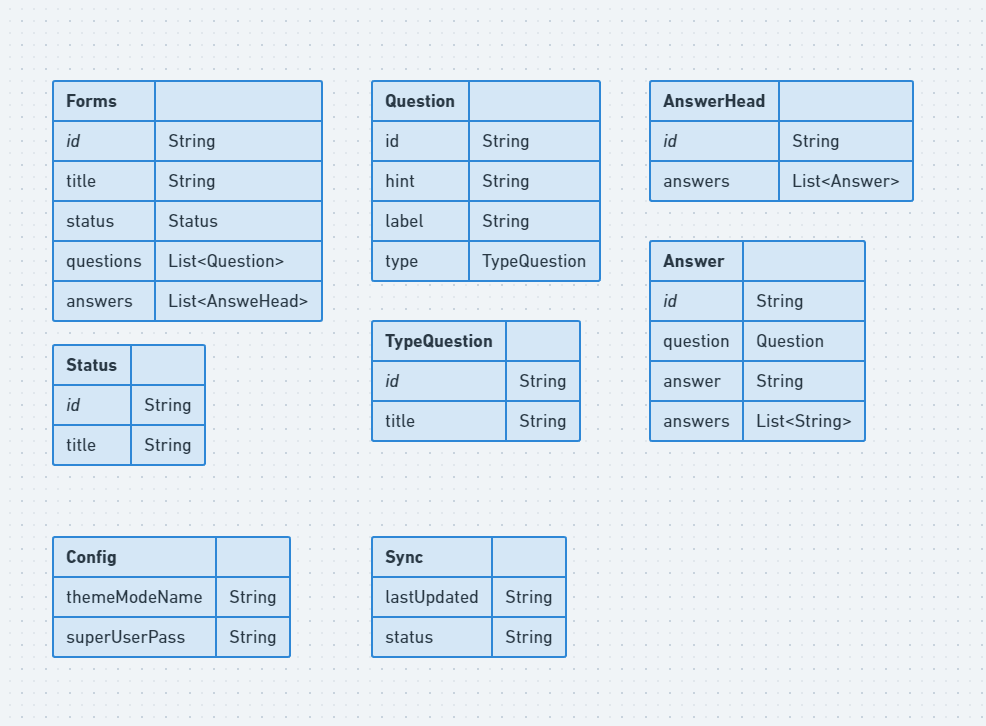

# Arquitetura

# Objetivo

Esse documento tem por objetivo principal gravar resposta de um formulário.

# Regras iniciais, limite e Análise

Pontos a serem levados em consideração antes de introduzir uma nova feature:

- Todo projeto precisará respeitar as regras de Lint escritas no pacote flutterando-analysis.
- Camadas globais devem ter um lugar específico na aplicação, por tanto, devem estar na pasta Shared.
- Cada feature deverá ter sua própria pasta onde conterá todas as camadas necessárias para a execução dos casos de uso da feature.
- Todos os designs patterns usados no projeto devem estar listados na sessão “Design Patterns” desse documento, caso contrário será considerado implementação errônea.
- Packages e plugins novos só poderão ser usados nos projetos após avaliação e aprovação de toda equipe responsável pelo projeto.
- Atualizações no Modelo de domínio só poderão ser aceitas se primeiro for adicionada nesse documento e aprovado por todos os envolvidos no projeto.
- Não é permitido ter uma classe concreta como dependência de uma camada. Só será aceita coesão com classes abstratas ou interfaces. Com exceção da Store.
- Cada camada deve ter apenas uma responsabilidade.

# Entidades

# Casos de Uso
**Board Formulário**
- Carregar formulários (Forms)
- Excluir formulário (Forms)

**Criação/Edição de Formulário**
- Carregar dados do formulário (Forms + Status)
- Excluir uma pergunta do formulário (Question)
- Criar/Editar formulário (Forms)
- Excluir formulário (Forms)

**Criação/Edição perguntas de Formulário**
- Carregar dados da pergunta (Question + TypeQuestion)
- Criar/Editar perguntas de formulário (Question)
- Excluir pergunta do formulário (Question)

**Cadastrar/Editar respostas de Formulário**
- Carregar perguntas/respostas (AnswerHead)
- Salvar respostas do formulário (AnswerHead)

**Board de respostas de Formulário**
- Carregar repostas (AnswerHead)
- Excluir respostas (AnswerHead)

**Configuraões**
- Validar senha de super usuário (Config)
- Modificar senha de super usuário (Config)
- Carregar configurações (Config)
- Salvar configurações (Config)
- Resetar configurações (Config)

**Sincronização**
- DownloadBoards (Sync + Forms + AnswerHead)
- UploadBoards (Sync + Forms + AnswerHead)

# Design Patterns

- Repository Pattern: Para acesso a multiplas fonte de dados.
- Datasource Pattern: Para acesso a dados (API/Banco de dados)
- Service Pattern: Para isolar trechos de códigos com outras responsabilidades.
- Entity Pattern: Para definir as entidades da aplicação
- Dependency Injection: Resolver dependências das classes.
- Atomic State Pattern: Para isolar todos os states e actions.
- Reducer Pattern: Para isolar todas as Business rules.
- State pattern: Padrão que auxilia no gerenciamento estados.
- Adapter: Converter um objeto em outro.
- Result: Trabalhar com retorno Múltiplo.

# Package externos

- result_dart: Retorno múltiplo no formato Failure e Success.
- flutter_modular: Modularização de rotas e injeção de dependências.
- realm: Banco de dados e sincronização
- rx_notifier: Gerenciamento de estado
- asuka: Snackbars e overlays personalizadas
- loader_overlay: Overlay de loader
- uno: Cliente HTTP.
- Mocktail: Para testes de unidade.
- intl: Internacionalização.
